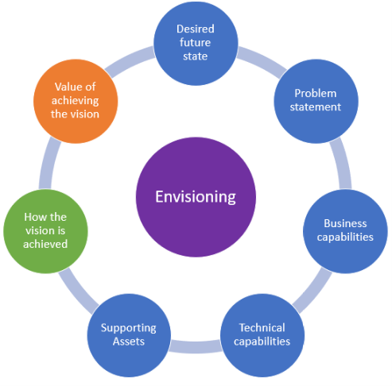

# Driving the customer conversation and identifying a compelling business case

Artificial Intelligence and Machine Learning are among the hottest topics in modern IT. Almost every business decision maker has been already exposed to a barrage of information (mostly marketing) originating from various vendors ranging from individual freelancers to large organizations. Nowadays everybody has AI/ML on the list of top priorities. 

While this context certainly helps driving the customer conversion, you must be alert about its shortcomings:
- Oversized and over-hyped expectations
- The "hammer in hand makes all things look like nails" syndrome - people being eager to use AI/ML anywhere, even in cases where it's not appropriate, mostly for the sake of posing with the AI/ML badge
- Oversimplification of requirements, risks, and effort related to AI/ML projects

You should definitely fuel the interest that already exists in most customer organizations. The best strategy you can apply is to drive the discussion towards existing business pain points that can be potentially addressed with machine learning. The following general rules can help you be more efficient in driving this customer conversation:

- Avoid directions that do not end up with real business pain points (e.g. we'd like to see how automated ML works in general).
- Always look for measurability of success - how can business stakeholders be convinced a machine learning project would produce results they can measure and understand.
- Avoid opening too many fronts - in many cases the customer will tell you they want multiple problems being addressed (e.g. segmentation, churn, propensity to buy, and customer lifetime value in retail). Focus initially on the problem that seems to be the most important to the customer, or the problem for which results are easiest to measure (all other things being equal).

A compelling business case is defined by the following:

- Refers to a clear business pain that is top of mind in the customer organization
- Has a clear way to understand the results produced by a solution
- Has a clear way to measure ROI

# Envisioning the solution
The opportunity is to help your clients envision the possibility of machine learning, and what it could bring to their organizations – helping them see a roadmap where machine learning becomes more and more a part of their daily operations and the benefits this brings. 

Envisioning sessions help the customer understand the opportunities for machine learning in their business requirements, while relying on the you to keep the conversation grounded in what is possible versus what is hyperbole.

An envisioning session is a common agile methodology practice that is particularly important for machine learning engagements as it is up to the you to help the customer realize the opportunities for machine learning in the customer’s problem statement.

The challenge is few customers will know if their problem represents a good opportunity to apply machine learning, or even if machine learning is the correct approach in their situation. As a partner, you need to have a discussion with your customer about their problem and be on the lookout for opportunities to build the solution using machine learning. You need to recommend the application of machine learning when it is appropriate, as well as discourage its application when machine learning would not be successfully applied in the near term. For example, the customer may want to build a predictive solution, but the labeled training data does not exist and would take years to collect. This type of high level requirements conversation is called an envisioning session.  
 
The outcome of an envisioning session is a common vision with your customer on capturing what may be achieved, the very high-level mechanism by which it will be achieved and the potential value of achieving this vision.  

The envisioning session is not intended to be an in-depth, big requirements up-front requirements gathering event that takes weeks or months to complete. Instead, an envisioning session is something that can be conducted in 1-3 days depending on the complexity of the business scenario, and how much explanation the partner team needs from the customer about their scenario. 

During the envisioning session you will begin by identifying the customers desired future state. On your way to defining how the vision is achieved and the value it would bring to the business, you will discuss the problem statement, the business and technical capabilities desired as well those that are available and the existence of supporting assets (such as data sets).

The benefits of conducting an envisioning session are:
- You can answer fundamental business questions of what you will build, and a general sense of how.
- You will have improved productivity on the project having identified and thought through the critical business issues facing the project.
- You will have identified the overall business direction required by your architecture.
 
After completing an envisioning session:

- The customer will have a vision of how your machine learning practice can help their organization realize their goals and drive business impact. They are excited by the value unlocked in the application of machine learning.
- You will have sufficient knowledge to write a proposal for an engagement. 
- You will have likely identified additional opportunities to apply machine learning to the customer’s scenarios, and have thus already started identifying additional scope for future engagements.

To be clear, an envisioning session is not:
- An architecture design session (introduced later).
- A project planning effort.
- A technology selection effort.
If you find that your envisioning conversation with your customer is headed in either of these directions, pause. Evaluate if you have suitably addressed the core questions. If the core questions have been addressed, then you should formally conclude the envisioning session and allow time for your team to process the input and return with recommendations on next steps (which could be a proposal for a design, a PoC, or a pilot). 
If not, then you should guide the conversation away from getting too much into the architecture, technology selection or other implementation details. 

## How to deliver an envisioning session
To deliver an envisioning session correctly means to have a loosely structured conversation (ideally in front of a white board) where you brainstorm with the customer about each of the following core questions. It is entirely possible to iterate multiple times through these core questions, each time refining details. Remember this is a high-level conversation.



1.	What is the customer’s desired future state?
2.	What is the problem the customer is trying to solve?
3.	What are the customer’s business capabilities with respect to the problem? For example, do they have experience in the domain for which they are trying to enter? 
4.	What are the customer’s technical capabilities with respect to the problem? For example, do they have technical resources who have worked with the data in the domain? If they had a solution in hand, could they operate it?
5.	What are the supporting assets? For example, do they have the requisite historical data upon which to train predictive capabilities?
6.	How will they know when the vision is achieved?
7.	What is the value of achieving the vision?

> *The above envisioning session materials includes content from the [Microsoft AI Practice Development Playbook](https://assetsprod.microsoft.com/mpn/en-us/get-ai-playbook.pdf) which provides a comprehensive guide for building an AI Practice in the Microsoft ecosystem. 

# Driving a Machine Learning architecture design session with a customer

An architecture design session is a working session between your experts and the customer. It should follow the envisioning session and build on the customer’s vision already established.

This intensive, two-day session delivers in-depth technical information on integrating data from across your customer’s entire organization and delivering it in an analysis-ready form. Presentations, demonstrations, and whiteboard discussions are customized to address your customer’s needs. In many cases, the design session is used to identify candidate proofs of concept. The primary audience includes architects, developers & data scientists, test and quality assurance (QA) engineers, and technical staff, and here are some potential topics to cover:
- Document solution architecture: Document how all the services and components fit together to deliver the complete AI solution, end to end. 
- Identify pre-built AI & custom AI: Identify what components of the AI solution will integrate pre-built AI, and which will require custom machine learning modeling efforts to produce custom AI.
- Catalog data assets: Collect the catalog of data assets that will be needed for any machine learning modeling efforts. Be sure to document the pipeline with which this data is collected, the anticipated quality of the data, and any other factors that can complicate preparing the data for modeling.
- Hone in on missing data: Attempt to identify situations where the vision requires data that the customer does not currently have. Identify how this missing data will either be procured, created or its absence worked around.
- Discuss risk: During the ADS, it may become apparent that parts of the solution have a high risk of failure or the client is skeptical about achieving the vision. Consider marking these parts as candidates for a PoC. 
- PoC or Pilot: Consider if the solution should be delivered as one or more PoCs, or if it is more appropriate to prepare for production directly by delivering a pilot.
- Post-production monitoring: Work with the customer to define how the AI will be measured after production delivery. How do you continue to ensure on-going performance?

## Phases of a successful ADS 

**Before the ADS**

Prior to performing the ADS, it is important to conduct a simple session with the customer to establish the scenario. This session is oftentimes referred to as ideation or opportunity definition. The goal is to establish the five Ws (who, what, when, where, and why) of their needs, which can be used as a guide for the ADS, streamlining the brainstorming process, and informing the agenda and milestone goals you will bring to the session.
- Perform an envisioning session: Prior to the ADS, perform an envisioning session to identify preliminary opportunities that would benefit from AI.
- Schedule a time for the design session: This is normally 1–2 days.
- Schedule a location: Ensure you have whiteboards and a projector.
- Schedule resources: This could include experts from your team and a cross-cutting panel of technical and business stakeholders from the customer.
- Build an agenda: Establish milestone goals in advance so that the ADS doesn’t get consumed discussing a single topic.
- Prepare preliminary documentation and architectural diagrams: Even if you only have the basic building blocks, it’s good to come prepared with something you can modify during or after the session.

**During the ADS**

Begin by reviewing requirements with your customer. As you conduct the design session, whiteboard the requirements and proposed solutions, and arrive at a consensus for each major topic. During this time, be sure to capture photos of the whiteboard so as not to lose your notes.
There are typically the following phases during an architecture design session: discovery, envisioning, and planning.
 
*Discovery*
- Customer background and business technology strategy
- Project background and its drivers/aims
- Functional and non-functional requirements
- Usage scenarios
- Technology landscape
- Data assets

*Envisioning*
- Key functions and capabilities
- Components of the solution
- External connections and integration points
- Security considerations
- Abilities considerations
- Map requirements and scenarios to components

*Planning*
- Establish proof points
- Exclusions, risks, and issues
- Pre-requisites
- Deliverables
- Resources
- Escalation, communication, and long-term plans

**After the ADS**

During the ADS, you and your customer planned a high-level architecture framework and conceptual design for a solution that addresses their organization’s business goals and technical requirements. In addition to a summary of the engagement, you’ll deliver information about:
- Special areas of concern to your customer’s organization, such as security, compliance, and compatibility.
- Deployment scenarios that map to established deployment and practices and that cite specific examples where applicable.
- Familiarity with the Microsoft technologies proposed for the solution, in addition to any trade-offs among the differing technology options.
- The capabilities of your solution to deliver business performance on premises or in the cloud.
The outcome should be polished architecture diagrams that can be reviewed and signed off on by the customer. If one or more proof of concepts are desired or a pilot is determined to be the path forward, provide a plan and a timeline to deliver. 


> *The above architecture design session materials includes content from the [Microsoft AI Practice Development Playbook](https://assetsprod.microsoft.com/mpn/en-us/get-ai-playbook.pdf) which provides a comprehensive guide for building an AI Practice in the Microsoft ecosystem. 

# Creating the project plan

A project plan for a machine learning project includes planning for these major components:
- Envisioning the AI opportunity with customer via an [**envisioning session**](#envisioning-the-solution).

- Performing an [**architecture design session**](#driving-a-machine-learning-architecture-design-session-with-a-customer) to identify requirements, clarify goals and focus in on the selection of a PoC or Pilot to implement, and the detailed requirements of the same.
  
- Executing a data science process to design, implement and operationalize the machine learning solution. 

To accelerate your efforts, this guide provides a project plan you can customize that uses the Microsoft Team Data Science Process in Azure DevOps. See the [Project plan template](../../delivery-guide/4-templates-and-checklists/README.md) in the templates and check lists section of this guide.


# Estimating the project cost

The overall cost of the project is ultimately driven by the combination of the following components:
- The cost of **human resources** working on the project, such as data scientists, data engineers, developers, architects and project managers. Computing these requires your understanding of the project delivery team and their relevant hourly costs, along with estimates of hourly effort anticipated for each resource throughout the delivery of the project.
- The cost of **cloud resources**, such as Azure Machine Learning, compute and storage. These an be readily estimated using the [Azure Pricing Calculator](https://azure.microsoft.com/pricing/calculator/) for each component in the solution. Estimates created using the pricing calculator can be saved and shared, for example this [machine learning solution](https://azure.com/e/003f781a4ac04a369b45d1d50c006063) is involving data preparation and modeling using Azure Machine Learning compute, model deployment as web services using an AKS cluster and data storage within Azure Storage.
- The costs associated with any **licensed components** such as software tools or data sets.

The following table provides a detailed list of the most important cost generators in a machine learning project:

Category | Name | Description | Costs
--- | --- | --- | ---
Data ingestion and preparation | [Azure Data Factory](https://azure.microsoft.com/en-in/services/data-factory/) | Integrates various data silos, used to construct ETL and ELT processes using a serverless approach. | [Azure Data Factory pricing](https://azure.microsoft.com/en-in/pricing/details/data-factory/)
Data ingestion and preparation | [Azure Databricks](https://azure.microsoft.com/en-us/services/databricks/) | Highly scalable Apache Spark environment that supports Python, Scala, R, Java, and SQL, as well as data science frameworks and libraries including TensorFlow, PyTorch, and scikit-learn. Typically used when the data preparation workload is highly complex and resource intensive. | [Azure Databricks pricing](https://azure.microsoft.com/en-us/pricing/details/databricks/)
Data ingestion and preparation / Model training and evaluation / Batch scoring | AML compute | Compute resources managed via the Azure Machine Learning service workspace. | [AML compute pricing](https://azure.microsoft.com/en-us/pricing/details/virtual-machine-scale-sets/)
Model deployment (production) | [Azure Kubernetes Service](https://azure.microsoft.com/en-in/services/kubernetes-service/) | Fully managed service for deploying and managing containerised applications. | [AKS deployment pricing]( https://azure.microsoft.com/en-us/pricing/details/machine-learning-service/)
Model deployment (dev/test) | [Azure Container Instances](https://azure.microsoft.com/en-us/services/container-instances/) | Serverless containers environment.| [ACI deployment pricing](https://azure.microsoft.com/en-us/pricing/details/container-instances/)
Model deployment | [Azure Container Registry](https://azure.microsoft.com/en-us/services/container-registry/) | Private Docker container registry. AML service uses the Basic tier. | [ACR pricing](https://azure.microsoft.com/en-us/pricing/details/container-registry/)
All-purpose storage | [Azure Block Blob Storage](https://azure.microsoft.com/en-us/services/storage/blobs/) | Massively scalable object storage for unstructured data. AML service uses the general purpose v1 tier with LRS (locally-redundant storage). | [Block blob storage pricing](https://azure.microsoft.com/en-us/pricing/details/storage/blobs/)
Secrets management | [Azure Key Vault](https://azure.microsoft.com/en-us/services/key-vault/) | Safeguards secrets used by cloud apps and services. AML uses the Standard tier. | [Azure KeyVault pricing](https://azure.microsoft.com/en-us/pricing/details/key-vault/)
MLOps | [Azure DevOps](https://azure.microsoft.com/en-us/services/devops/) | Manages all aspects of your machine learning projects using advanced features like boards, pipelines, repos, test plans and artifacts. Combined with features from the Azure Machine Learning service, Azure DevOps provides the core backbone of end-to-end, comprehensive MLOps implementations. | [Azure DevOps pricing](https://azure.microsoft.com/en-us/pricing/details/devops/azure-devops-services/)
Tools | [Visual Studio Code](https://code.visualstudio.com/) |  Lightweight but powerful source code editor which runs on your desktop and is available for Windows, macOS and Linux. It comes with built-in support for JavaScript, TypeScript and Node.js and has a rich ecosystem of extensions for other languages (such as C++, C#, Java, Python, PHP, Go) and runtimes (such as .NET and Unity). | Free
Tools | [Visual Studio](https://visualstudio.microsoft.com/) | Microsoft's core development environment that supports a wide range of workloads like web and cloud, Windows, mobile and gaming, Office and SharePoint, and Data Science and analytical applications. | [Visual Studio pricing](https://visualstudio.microsoft.com/vs/pricing/)

In addition to the compute resources mentioned above, the following might be used in a machine learning solution:
- [Data Science VMs](https://azure.microsoft.com/en-us/services/virtual-machines/data-science-virtual-machines/) - see [pricing](https://azure.microsoft.com/en-us/pricing/details/virtual-machines/windows/)
- [Data Lake Analytics](https://azure.microsoft.com/en-us/services/data-lake-analytics) compute resources - see [pricing](https://azure.microsoft.com/en-us/pricing/details/data-lake-analytics/)
- [HDInsight](https://azure.microsoft.com/en-us/services/hdinsight/) clusters - see [pricing](https://azure.microsoft.com/en-us/pricing/details/hdinsight/)


Other elements to be considered when estimating platforms, services, and tools costs are:
- [Azure support plans](https://azure.microsoft.com/en-us/support/plans/)
- [Azure reserved instances](https://azure.microsoft.com/en-us/pricing/reserved-vm-instances/) - make sure you understand the differences between ```Pay as you go``` vs. ```1 year reserved``` vs. ```3 years reserved```
- Cost variations depending on the type of Azure subscription used (Pay-as-you-go, CSP, EA etc...)


The all-up project cost estimates are typically collected and managed in [simple Excel spreadsheets](https://github.com/Azure-Samples/Azure-MachineLearning-DataScience/blob/master/Team-Data-Science-Process/Project-Planning-and-Governance/Advanced%20Analytics%20Microsoft%20Project%20Plan.xlsx), or thru more comprehensive solutions including [Microsoft Project Online](https://products.office.com/en-us/project/project-and-portfolio-management-software) and [Microsoft Dynamics 365 Project Services Automation](https://dynamics.microsoft.com/en-us/project-service-automation/capabilities/). 

# Assessing risks

Machine learning projects suffer from all the potential risks of a traditional software project coupled with many others that result from their experimental nature. When planning a machine learning project, consider asking the following questions to help you assess the risks and, if possible, mitigate them within your project plan.

**Data:**
- Is the requisite data available to support modeling goals? 
- Does the data fully support the goals or does additional data need to be identified or generated for model training purposes?
- Are their heavy data integration or data preparation efforts required prior to the data being useful for modeling?

**Timeline:**
-  Does the schedule allow sufficient time for experimentation of multiple approaches to data preparation, algorithm selection, etc.? 
-  Does the schedule allow for evaluation by the business stakeholders before the solution is released?
-  Are the desired models feasible to train against the volume of data in the time provided? 

**Budget:**
-  Does the budget allocate sufficient amounts towards the computation resources needed for model training and evaluation?

**Team:**
-  Does the team have the requisite technical expertise to deliver the solution?
-  Does the team have the right subject matter experts to inform the domain understanding of the delivery team?

**Success criteria:**
-  What is the fallback approach in case the first approach is not successful? 
-  Is the definition of project success clear to all stakeholders?

Additionally, one should consider how the project is designed with responsible AI in mind, as discussed in the next section.

# Designing for security, trust and responsible AI 

Microsoft has identified six principles* that should be used to guide AI development and use:


- **Privacy and Security**: Protecting privacy and securing important personal and business information as access to data is essential for AI systems to make accurate and informed predictions and decisions about people.
- **Accountability**: The people who design and deploy AI systems must be accountable for how their systems operate. 
- **Reliability and Safety**: AI systems operate reliably, safely, and consistently under normal circumstances and in unexpected conditions.
- **Fairness**: AI systems should treat everyone fairly and avoid affecting similarly situated groups of people in different ways.
- **Inclusiveness**: everyone should benefit from intelligent technology, meaning it must incorporate and address a broad range of human needs and experiences.
- **Transparency**: As AI systems are used to help inform decisions that have tremendous impacts on people’s lives, it is critical that people understand how those decisions were made.

It is important to recognize that transparency and accountability are foundational principles that ensure the effectiveness of the other principles. 

> NOTE: One helpful mnemonic to help you remember these six principles is PARFIT, which means *perfect* in Old French. 

> *The above definitions are from the [Identifying Guiding Principles for Responsible AI](https://docs.microsoft.com/en-us/learn/modules/responsible-ai-principles/) course available for free on Microsoft Learn.  

When it comes to designing your AI solution and how it will interact with human users, Microsoft has published a series of 18 design guidelines you should consider as the solution evolves from initial design to post-release, see [Guidelines for Human-AI Interaction](https://www.microsoft.com/en-us/research/publication/guidelines-for-human-ai-interaction/).

For each of the aforementioned six principles, Microsoft has compiled a list of [engineering tools for responsible AI](https://docs.microsoft.com/en-us/learn/modules/microsoft-responsible-ai-practices/3-responsible-ai-tools) you should consider (from guidance to open source code, technologies, tools and training materials). These are a part of the [Discuss practices for responsible AI at Microsoft](https://docs.microsoft.com/en-us/learn/modules/microsoft-responsible-ai-practices/) course available on Microsoft Learn. 

For example, in support of the **transparency** principle, the list suggests the use of the [model interpretability features of Azure Machine Learning](https://docs.microsoft.com/en-us/azure/machine-learning/service/machine-learning-interpretability-explainability).