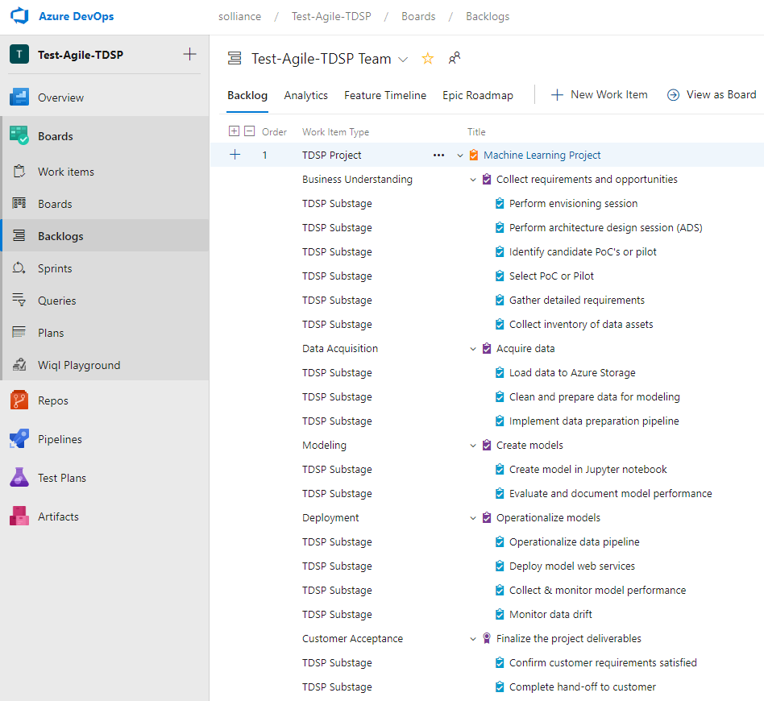

# Project plan template

Machine learning projects can be executed using one of many lifecycles like the Cross Industry Standard Process for Data Mining ([CRIP-DM](https://wikipedia.org/wiki/Cross_Industry_Standard_Process_for_Data_Mining)) or Knowledge Discovery in Databases ([KDD](https://wikipedia.org/wiki/Data_mining#Process)) which fundamentally address the reality that machine learning projects are highly iterative approaches moving between the conceptual stages of requirements gathering, data collection, data preparation, modeling, model deployment and model maintenance, often exhibiting cycles that loop back to a previous stage as details are refined. 

In this guide, we recommend the use of the [Microsoft Team Data Science Process](https://docs.microsoft.com/azure/machine-learning/team-data-science-process/agile-development) (TDSP) with an agile approach. 

The five major stages of TDSP are as follows and are illustrated in the subsequent diagram:
- [Business understanding](https://docs.microsoft.com/azure/machine-learning/team-data-science-process/lifecycle-business-understanding): Specify the key variables that are to serve as the model targets and whose related metrics are used determine the success of the project; Identify the relevant data sources that the business has access to or needs to obtain.
- [Data acquisition and understanding](https://docs.microsoft.com/azure/machine-learning/team-data-science-process/lifecycle-data): Produce a clean, high-quality data set whose relationship to the target variables is understood. Locate the data set in the appropriate analytics environment so you are ready to model; Develop a solution architecture of the data pipeline that refreshes and scores the data regularly.
- [Modeling](https://docs.microsoft.com/azure/machine-learning/team-data-science-process/lifecycle-modeling): Determine the optimal data features for the machine-learning model; Create an informative machine-learning model that predicts the target most accurately; If delivering a pilot, create a machine-learning model that's suitable for production.  If delivering a PoC, create a machine-learning model that addresses that proves out the feasibility and addresses identified risks.
- [Deployment](https://docs.microsoft.com/azure/machine-learning/team-data-science-process/lifecycle-deployment): Deploy models with a data pipeline to a production or production-like environment for final user acceptance. 
- [Customer acceptance](https://docs.microsoft.com/azure/machine-learning/team-data-science-process/lifecycle-acceptance): Finalize the project deliverables: Confirm that the pipeline, the model, and their deployment in a production environment satisfy the customer's objectives for the pilot or PoC.

A machine learning project executes the major stages of TDSP using an agile methodology and as such can leverage project management tools designed for agile delivery. 

## Using the Azure DevOps Project Template

In this guide, we recommend the use of Azure DevOps and a work item process template derived from the Agile work item process that is included with Azure DevOps. This approach provides support for the concepts of Features, User Stories, Tasks and Bugs of the traditional agile process, but modified to use the terminology of TDSP.

A typical starter project using this TDSP process template in Azure DevOps has the follow structure of work items.

To accomplish this structure, the setup process of your Azure DevOps environment involves the following two steps:

1. Configure your Azure DevOps environment with a TDSP agile process template. This typically only needs to be done once. If you work within multiple Azure DevOps organizations, you will need to do this once per organization.

2. Create a new Azure DevOps project and populate the TDSP work items. This needs to be done for each new project. As a bare minimum we recommend starting any new project with the following work items:

    | Work Item Type	| Title	|
    | --- | --- |
    |TDSP Project	| Machine Learning Project|
    | Business Understanding | Collect requirements and opportunities | 
    | TDSP Substage  |Perform envisioning session	|
    | TDSP Substage  |Perform architecture design session (ADS)	|
    | TDSP Substage  |Identify candidate PoC's or pilot	|
    | TDSP Substage  |Select PoC or Pilot	|
    | TDSP Substage  |Gather detailed requirements	|
    | TDSP Substage  |Collect inventory of data assets	|
    | Data Acquisition	| Acquire data	|
    | TDSP Substage  |Load data to Azure Storage	|
    | TDSP Substage  |Clean and prepare data for modeling	|
    | TDSP Substage  |Implement data preparation pipeline	|
    | Modeling	| Create models	|
    | TDSP Substage  |Create model in Jupyter notebook	|
    | TDSP Substage  |Evaluate and document model performance	|
    | Deployment	| Operationalize models	|
    | TDSP Substage  |Operationalize data pipeline	|
    | TDSP Substage  |Deploy model web services	|
    | TDSP Substage  |Collect & monitor model performance	|
    | TDSP Substage  |Monitor data drift	|
    | Customer Acceptance	|Finalize the project deliverables	|
    | TDSP Substage  |Confirm customer requirements satisfied	|
    | TDSP Substage  |Complete hand-off to customer	|

For step-by-step instructions on how to create the agile-derived TSDP process template and then how to create a new Azure DevOps project that uses this template (as illustrated above), see [Using an agile TDSP template](https://docs.microsoft.com/en-us/azure/machine-learning/team-data-science-process/agile-development#use-an-agile-tdsp-work-template)

# Human Resources Qualification Checklist

The key roles in a machine learning practice are summarized below.

| ROLE | DESCRIPTION |
| --- | --- |
| Data/AI Scientist | Models complex business problems, discovering new business insights and opportunities to apply AI, machine learning and deep learning.
| Data Architect | Designs the AI solution, including how data is ingested, stored and processed, and works with the data scientist to identify where model training occurs, and how trained models are deployed for production use. Provides the roadmap that is implemented by the data engineers and data developers.
| Data Engineers | Works with the data architect to provides the infrastructure to make data accessible to the data scientists.
| Machine Learning Developers | Provides the code and automation to make data accessible to data scientists, assists in data collection, preparation and correlation and in enabling API access to deployed models.

## Key Data Scientist Qualifications
- Three or more years experience in customer facing roles 
- Cross-disciplinary background consisting of statistics and software development
- A technical BS degree in Computer Science or Mathematics is highly desirable. While a masters or PhD in data science is desirable, many practitioners have honed their expertise after years on the job (in many cases before data scientist became a standard role).  
- Project experience in some of the following:
  - advanced analytics (including machine learning)
  - automating data munging
  - building visualizations 
  - machine learning modeling 
  - distributed training 
  - training on large data sets 
  - operationalizing models 
  - dealing with significant algorithmic or modeling challenges
- Project experience with some of these programming languages: Python, R, Scala, DMX, DAX, MDX, SQL, T-SQL, Java
- Project Experience with some of these platforms: Linux (Red Hat, Ubuntu, Debian, etc.), Windows.

## Key Data Architect Qualifications
- Experience in customer facing roles and success leading deep technical architecture and design discussions with senior executives. 
- Five plus years of experience with deep understanding of databases and analytics, including relational databases, data warehousing, big data, business intelligence and analytics.
- Five plus years of success in consultative/complex technical sales and deployment projects. 
- Technical BS degree in Computer Science or Math background desirable.
- Project experience in some of the following:
  - Advanced analytics (including machine learning) 
  - database modernization 
  - coordinate and execute pilots 
  - prototypes or proof of concepts 
  - provide validation on specific scenarios 
  - document and share technical best practices 
  - further customer investment 
  - hybrid solutions on premises or in the cloud industry-visible 
  - large project relative to size of customer 
  - lift and shift 
  - migrations and upgrades (SQL, etc.) 
  - on-premises to cloud 
  - production environment 
  - projects where data is born in the cloud 
  - cross-platform SQL Server migration 
  - size of project team (complexity) 
  - significant challenges 
  - IoT – Connected Devices 
  - IoT- Command and Control IOT- Data Ingestion 
  - batch analytics 
  - interactive analytics 
  - real-time/streaming analytics.
- Project experience with some of these programming languages: C#, DMX, DAX, MDX, SQL, T-SQL, Java, Scala, Python, PowerShell, R, Ruby. 
- Project Experience with some of these platforms: Linux (Red Hat, Ubuntu, Debian, etc.), Windows.

## Key Data Engineer Qualifications
- Three or more years’ experience deploying, monitoring and managing solutions that collect, process, store and analyze huge volumes of data, fast moving data or data that has significant schema variability. 
- Project experience in some of the following:
  - Advanced analytics (including machine learning) 
  - automated data pipelines 
  - database modernization 
  - further customer investment 
  - hybrid solutions on premises or in the cloud 
  - industry-visible 
  - large project relative to size of customer 
  - lift and shift 
  - migrations and upgrades (SQL, etc.), on-premises to cloud 
  - production environment 
  - projects where data is born in the cloud 
  - cross-platform SQL Server migration 
  - size of project team (complexity) 
  - significant challenges 
  - IOT – Connected Devices 
  - IOT- Command and Control 
  - IOT- Data Ingestion 
  - batch analytics 
  - interactive analytics 
  - real-time/streaming analytics
- Project experience with some of these programming languages: C#, DMX, DAX, MDX, SQL, T-SQL, Java, Scala, Python, PowerShell, R, Ruby. 
- Project Experience with some of these platforms: Linux (Red Hat, Ubuntu, Debian, etc.), Windows.

## Key Machine Learning Developers Qualifications
- Three or more years’ experience working on solutions that collect, process, store and analyze huge volume of data, fast moving data or data that has significant schema variability.
- Project experience in some of the following: 
  - Advanced analytics (including machine learning) 
  - database modernization 
  - further customer investment 
  - hybrid solutions on premises or in the cloud 
  - industry-visible 
  - large project relative to size of customer 
  - migrations and upgrades (SQL, etc.) 
  - on-premises to cloud 
  - production environment 
  - projects where data is born in the cloud 
  - cross-platform SQL Server migration 
  - size of project team (complexity) 
  - significant challenges 
  - IOT – Connected Devices 
  - IOT- Command and Control 
  - IOT- Data Ingestion 
  - batch analytics 
  - interactive analytics 
  - real-time/streaming analytics
- Project experience with some of these programming languages: C#, DMX, DAX, MDX, SQL, T-SQL, Java, Scala, Python, PowerShell, R, Ruby. 
- Project Experience with some of these platforms: Linux (Red Hat, Ubuntu, Debian, etc.), Windows.

## Building the Machine Learning Project Team
With the key roles defined, how do you go about shaping the team for your machine learning project? While each project is unique, the following table provides guidance on the typical team construction for various scenarios:

| Scenario | # Data Scientist | # Data Architect | # Data Engineers | # Machine Learning Developers |
| --- | --- | --- | --- | --- |
| Small PoC: creating one model to validate the predictive capabilities of the data and delivering a notebook with the results | 1 | 0 | 0 | 0 |
| Mid-size PoC: the PoC includes not only modeling, but integration and data preparation | 1 | 1 | 1 | 1-3 |
| Large PoC: the PoC is robust, and informs or de-risks complex architectural concerns, you may have multiple teams of this size | 2-5 | 1-2 | 1-2 | 3-5 |
| Small Pilot: the pilot amounts to integrating a predictive web service with a production web app | 1 | 1 | 0-1 | 1-2 |
| Mid-size Pilot: the pilot involves significant integration, multiple models and both batch and real-time scoring modes | 2-3 | 1-2 | 3-5 | 3-5 |
| Large Pilot: the pilot involves a broad and complex domain, requires more than a few models and high scalability, you may have multiple teams of this size | 3-5 | 3-5 | 5-10 | 5-10 |

## More resources
The above materials includes content from the [Microsoft AI Practice Development Playbook](https://assetsprod.microsoft.com/mpn/en-us/get-ai-playbook.pdf) which provides a comprehensive guide for building an AI Practice in the Microsoft ecosystem. 

# Envisioning session template
The template and supporting checklists are available in this [PowerPoint slide deck](./envisioning-session-template-and-checklist.pptx).

# Architecture design session template and checklists
The template and supporting checklists are available in this [PowerPoint slide deck](./ads-template-and-checklists.pptx).

# Security checklist

The complexity of machine learning projects generates security challenges that span the entire scope of training and scoring workloads. 

The following are typical security challenges for machine learning workloads:

Name | Description
--- | ---
Store training data | Ensure training data is stored with appropriate security.
Load training data | Ensure proper security is applied when connecting and reading from various data sources.
Prepare data | Ensure various intermediate forms and/or formats of data used in data preparation processes are stored securely (even if storage is temporary).
Manage datastores | In general, ensure access to various datastores is performed in a secure way. Avoid spreading datastore connecting credentials is source code, notebooks, config files, and the like. The recommended approach for Azure Machine Learning service is to use the [register datastore](https://docs.microsoft.com/en-us/azure/machine-learning/service/how-to-access-data) capabilities for secure management of connections. Also, make sure you understand the [data encryption features of Azure Machine Learning service](https://docs.microsoft.com/en-us/azure/machine-learning/service/concept-enterprise-security#data-encryption).
Manage trained models | Ensure trained machine learning models are stored in a secure environment (e.g. the Azure Machine Learning service model registry with versioning). Ensure trained models are not save (and left there) in various compute environments used for training workloads.
Deploy models for real-time scoring | Ensure models are deployed in secure environments. Ensure web service endpoints exposed for real-time scoring are properly secured and monitored for attempts to breach security (e.g. by using [HTTPS](https://docs.microsoft.com/en-us/azure/machine-learning/service/how-to-secure-web-service), [security keys vs. tokens](https://docs.microsoft.com/en-us/azure/machine-learning/service/concept-enterprise-security#authentication-for-web-service-deployment), Azure AD integration etc...). Make sure you follow proper security guidelines for [ACI](https://docs.microsoft.com/en-us/azure/container-instances/container-instances-image-security) or [AKS](https://docs.microsoft.com/en-in/azure/aks/concepts-security).
Deploy models for batch scoring | Ensure models are deployed in secure environments. Ensure proper security of all actions capable of starting a batch processing job.
Manage secrets | Ensure secrets are not left in easily accessible places (source code files, source code repositories, notebooks, scripts etc...). Wherever possible, use approaches that do not require specifying credentials at run-time. Perform the task of [regenerating storage account keys](https://docs.microsoft.com/en-us/azure/machine-learning/service/how-to-change-storage-access-key) ar regular intervals of time.
Manage workspaces | The Azure Machine Learning service is the main security boundary for [controlling access to machine learning resources](https://docs.microsoft.com/en-us/azure/machine-learning/service/concept-enterprise-security#authorization). Make sure you understand the [security impact of an Azure machine learning workspace](https://docs.microsoft.com/en-us/azure/machine-learning/service/concept-enterprise-security#securing-compute-targets-and-data).
Manage networking | Secure AML training and scoring jobs using [virtual networks](https://docs.microsoft.com/en-us/azure/machine-learning/service/how-to-enable-virtual-network).

