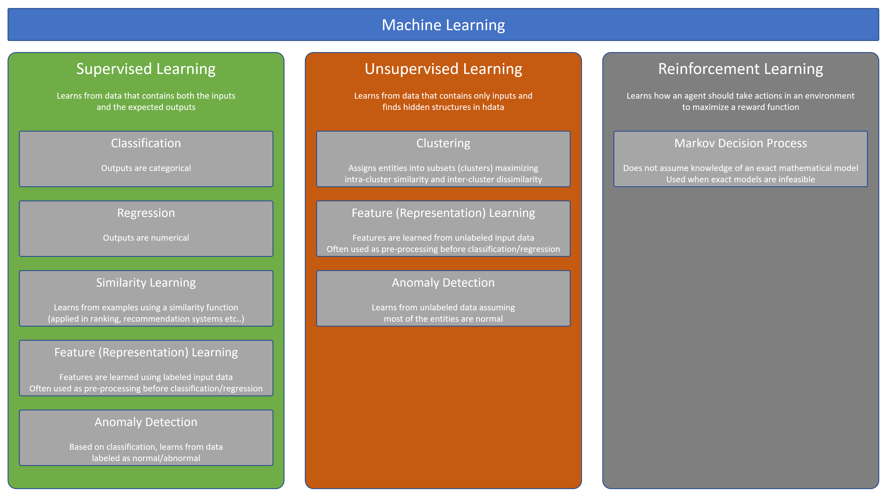

# Machine Learning horizontal scenarios

Besides all data-related tasks, every machine learning problem ends up being a problem of selecting one or more machine learning algorithms that, when applied to the data, yield results that meet the expected quality bar. The number of algorithms is impressive and this very number makes the choice apparently very difficult, especially in the context of PoC/Pilot projects where the resources are usually limited. To be proficient in identifying the right mix of algorithms to use it is important to understand how they differ in approach, types of data they input and output, and the category of problems they are intended to solve.

The most widely used occurrences of these combinations (approach, input/output data, problem category) are presented in the following diagram:

This section provides guidance on the following major approaches:

- [Supervised learning](supervised-learning.md)
- [Unsupervised learning](unsupervised-learning.md)
- [Semi-supervised learning](semi-supervised-learning.md)
- [Reinforcement learning](reinforcement-learning.md)

**Note**:

The list is not comprehensive as there are other approaches and combinations of approaches used today. Still, these are some of the cases you will most likely have to deal with in the PoC/Pilot phase of a Machine Learning project.