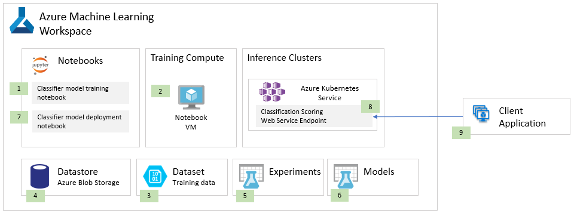

# Classification solution blueprint
The following diagram illustrates a blueprint for a solution that classifies samples (the input of which could be images, text or numeric samples). The classifier itself could be built using machine learning or deep learning approaches.

A Jupyter notebook (1) is created within a Notebook VM (2) provisioned within the Azure Machine Learning Workspace. The notebook uses the Azure Machine Learning Python SDK to retrieve the training data (a set of flat files) from the Dataset registered (3) with the Workspace and whose connection information (e.g., Storage Account Name and Key) to Azure Storage is defined in the Datastore (4). The supervised model training executes in the context of an Experiment run (5), which logs the training duration and other metadata about the training, collects the performance statistics collected during model evaluation performed in the notebook and relates this metadata with the actual model that is uploaded to the Models registry (6). A new notebook (7) is used to deploy the model as a web service running in Azure Kubernetes Service (8).  This deployment notebook defines the web service logic that retrieves the model from the Models registry (6), loads the model into memory and uses the loaded model for inferencing against every request for classification. This logic, along with the Conda and PIP dependencies are packaged into a Docker Container that is deployed by the notebook to the Azure Kubernetes Service (8) using the Azure Machine Learning Python SDK. Once deployed, the scoring web service handles the classification of input samples arriving from the client application (9) in the form of HTTP requests.
