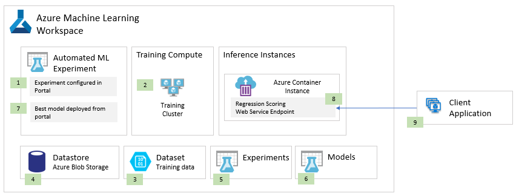

# Forecasting solution blueprint
The following diagram illustrates a blueprint for a solution that forecasts numeric outcomes for time series data. In this blueprint, the model is created using Automated ML.

An Automated ML Experiment (1) is created within the Azure Machine Learning Workspace in the Azure Portal. The Automated ML Experiment will be executed remotely on a Training Cluster (2), provisioning the Training Cluster as necessary as a part of the Experiment configuration. The Automated ML Experiment retrieves the time-series training data (a set of flat files) from the Dataset registered (3) with the Workspace and whose connection information (e.g., Storage Account Name and Key) to Azure Storage is defined in the Datastore (4). The Experiment trains multiple models using different combinations of hyper-parameters, algorithms and data preparation approaches. Model training executes in the context of an Experiment run (5), which logs the training duration and other metadata about the training, collects the performance statistics collected during model evaluation performed by Automated ML and relates this metadata with the actual model that is downloadable from the Experiment and can later be uploaded to the Models registry (6) by the user thru the Workspace. At the completion of the training, the Training Cluster is scaled down to zero nodes by code executed in the training notebook, saving compute resources while not in use. Using the Azure Machine Learning Workspace within the Portal, the user can directly deploy the model as a web service running in an Azure Container Instance (8). Once deployed, the scoring web service handles the forecasting against input samples arriving from the client application (9) in the form of HTTP requests.